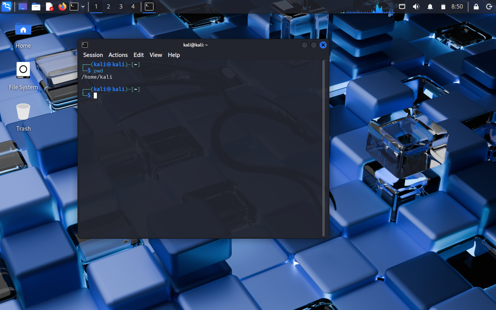
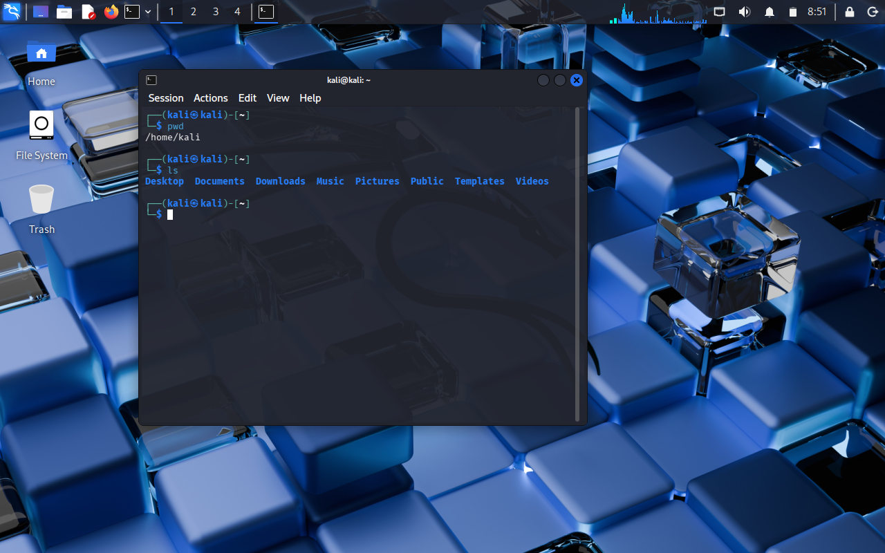
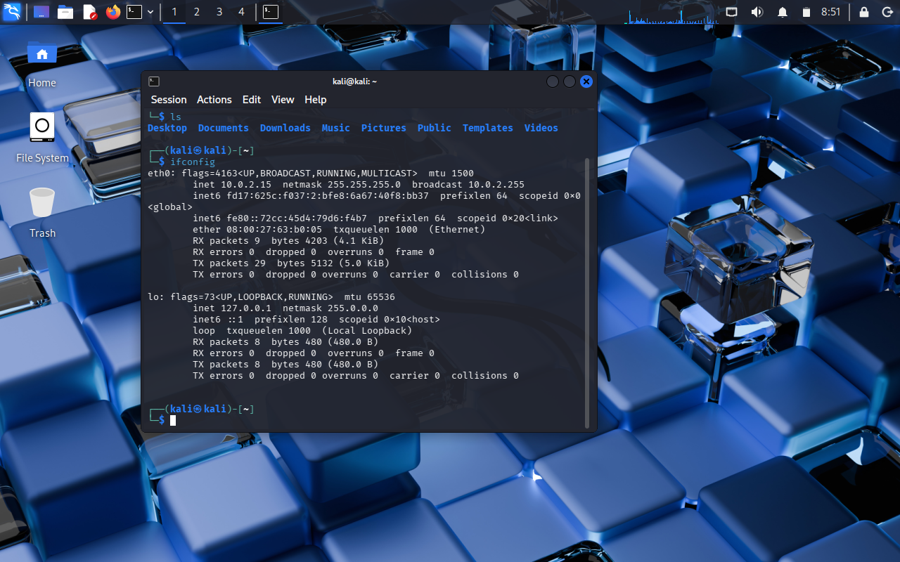
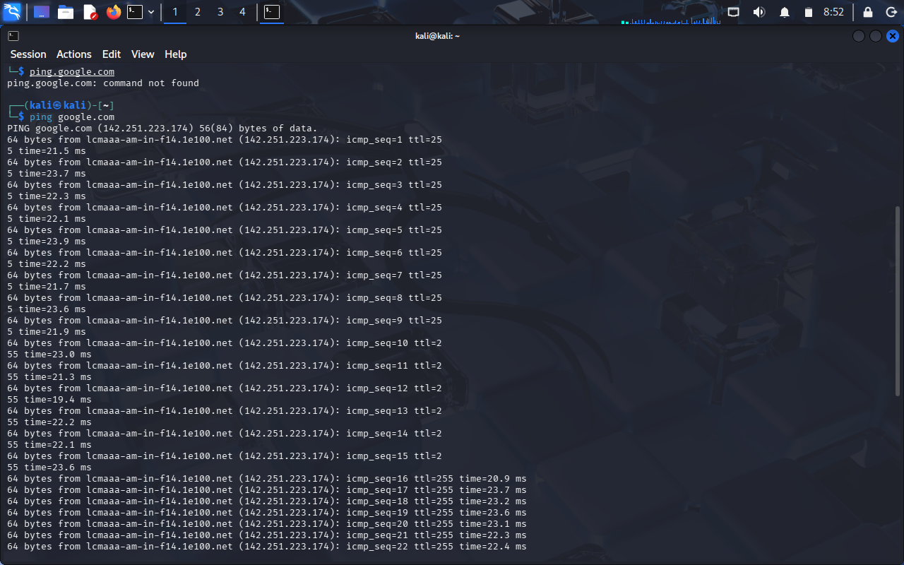
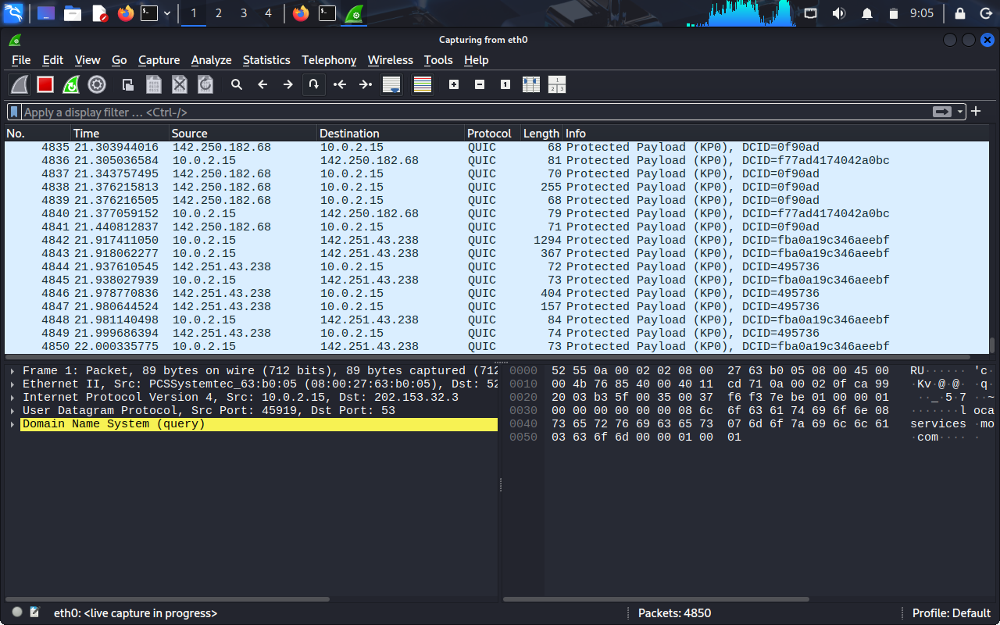
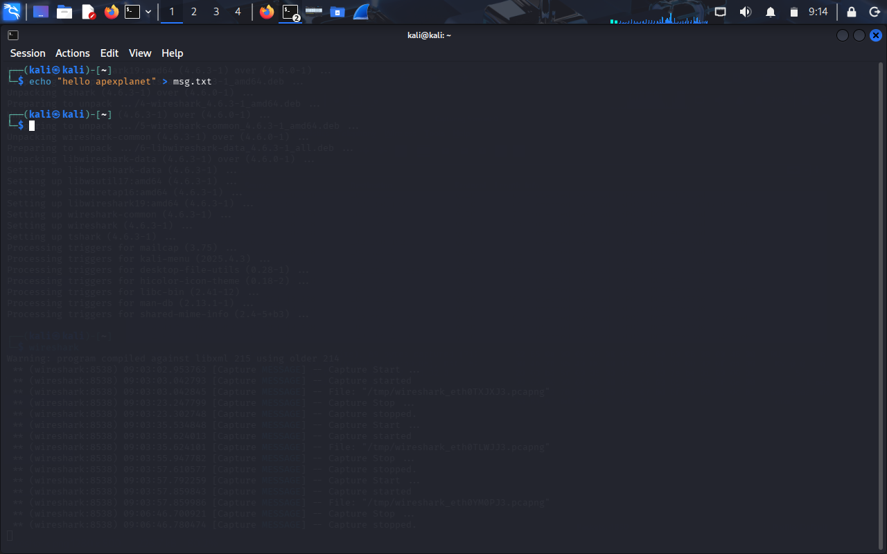
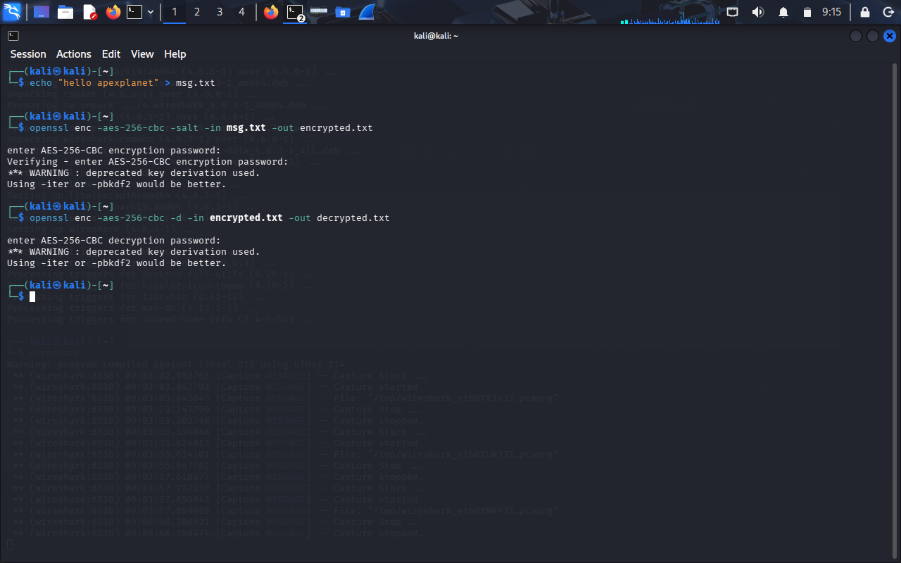
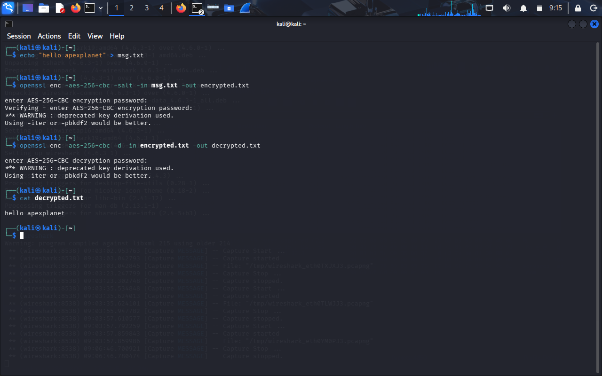

# ApexPlanet Internship – Task 1  
## Foundations of Cybersecurity & Environment Setup

### 👩‍💻 Intern Details
- Name: Anamika B. Pillai  
- Internship: Cybersecurity & Ethical Hacking  
- Task: Task 1 – Foundations & Environment Setup  

---

## 🎯 Objective
To build strong fundamentals in cybersecurity, networking, cryptography, and set up a professional penetration testing lab using Kali Linux.

---

## 🔐 Cybersecurity Basics
- CIA Triad: Confidentiality, Integrity, Availability  
- Threats: Phishing, Malware, DDoS, SQL Injection, Brute Force, Ransomware  
- Attack Vectors: Social Engineering, Wireless Attacks, Insider Threats  

---

## 🧪 Lab Environment Setup
- Virtualization Tool: VirtualBox  
- Attacker Machine: Kali Linux  
- Target Machine: Metasploitable2  
- Network Mode: Host-Only Adapter  

## Screenshots
Below are my screenshots supporting Task-1:

### Kali Linux Setup

### Network Settings

### Linux Commands

### Wireshark Capture

### OpenSSL Encryption & Decryption
.
.
.

## Video Demonstration
Here is my Task-1 video on LinkedIn:
< insert your linked in video URL >

---

## 🐧 Linux Fundamentals
Practiced:
- File system navigation (ls, cd, pwd)
- Permissions (chmod, chown)
- Package management (apt)
- Networking commands (ifconfig, ping, netstat)

---

## 🌐 Networking Basics
- OSI Model
- TCP/IP
- DNS, HTTP/HTTPS
- IP Addressing & NAT

---

## 🔑 Cryptography Basics
- Symmetric & Asymmetric Encryption
- Hashing (MD5, SHA-256)
- SSL/TLS
- Hands-on encryption & decryption using OpenSSL

---

## 🛠 Tools Familiarized
- Wireshark
- Nmap
- Burp Suite
- Netcat

---

## 📹 Video Demonstration
[Video](./https://www.linkedin.com/in/anamika-b-pillai-9b18b3303/details/featured/)
A 5-minute walkthrough video explaining the complete lab setup, tools, and commands has been uploaded to LinkedIn.

---

## ✅ Task Status
✔ Completed as per ApexPlanet internship guidelines
